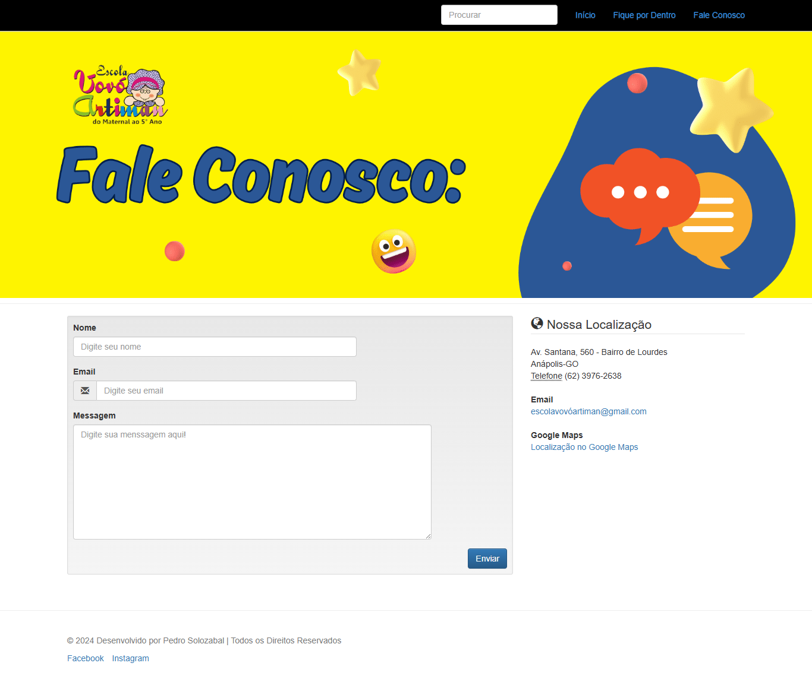
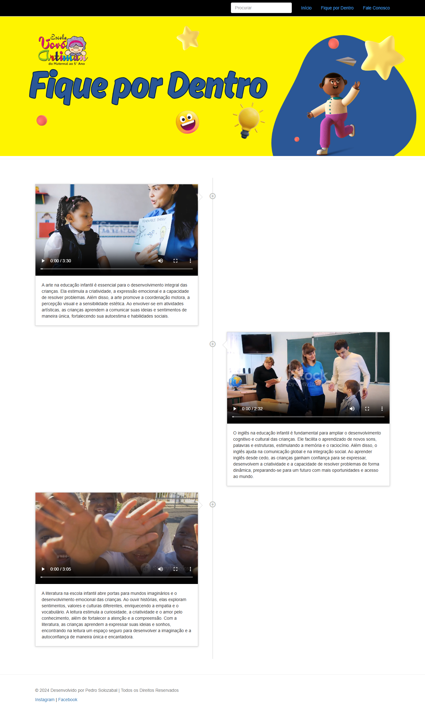

# 🌐 Anhanguera Extension Project I — Frontend

A visually appealing, multi-page academic site built with HTML5, CSS3 (Bootstrap + custom), and vanilla JavaScript for a structured, modern education presentation.

---

## ✨ Project Highlights

- **Multi-page static architecture**: `index.html`, `faleconosco.html`, `fiquepordentro.html`
- **Bootstrap-based layout** with custom styles
- **Responsive navigation and timeline**
- **Embedded videos, banners, icons, and illustrations**
- **Screenshots for instant visual impact**

---

## 🗂️ Structure

```plaintext
css/                  # Bootstrap, theme and custom styles
fonts/                # Glyphicons/fonts for UI components
img/
  ├── arte-logo.png   # Logo graphics
  ├── inglês-logo.png # English area logo
  ├── literatura-logo.png # Literature area logo
  ├── banner-vovóartiman.png
  ├── banner-vovóartiman-faleconosco.png
  ├── banner-vovóartiman-fiquepordentro.png
  ├── ...             # Other illustrations/banners
  └── screenshots/
      ├── index_home.png
      ├── contact.png
      └── news.png
js/                   # Bootstrap JS, npm.js scripts
videos/               # Media/video assets for news section
index.html            # Main page (Home)
faleconosco.html      # Contact page
fiquepordentro.html   # News page
.gitattributes
.gitignore
README.md
```

---

## 🖼️ Project Screenshots

<p align="center">
  
  <br><em>Landing Page — Home</em>
</p>
<p align="center">
  
  <br><em>Contact Page</em>
</p>
<p align="center">
  
  <br><em>News Page</em>
</p>

---

## 💡 Code Highlights

### 1. Responsive Navbar & Navigation

```html
<nav class="navbar navbar-findcond navbar-fixed-top">
  <div class="container">
    <div class="navbar-header">
      <button type="button" class="navbar-toggle collapsed" data-toggle="collapse" data-target="#navbar">
        <span class="sr-only">Toggle navigation</span>
        <span class="icon-bar"></span>
        <span class="icon-bar"></span>
        <span class="icon-bar"></span>
      </button>
    </div>
    <div class="collapse navbar-collapse" id="navbar">
      <ul class="nav navbar-nav navbar-right">
        <li class="active"><a href="index.html">Home</a></li>
        <li class="active"><a href="fiquepordentro.html">News</a></li>
        <li class="active"><a href="faleconosco.html">Contact</a></li>
      </ul>
      <form class="navbar-form navbar-right search-form" role="search">
        <input type="text" class="form-control" placeholder="Procurar" />
      </form>
    </div>
  </div>
</nav>
```

---

### 2. Timeline with Video Embeds ("fiquepordentro.html")

```html
<ul class="timeline">
  <li>
    <div class="timeline-badge primary"><a><i class="glyphicon glyphicon-record"></i></a></div>
    <div class="timeline-panel">
      <div class="timeline-heading">
        <div class="embed-responsive embed-responsive-16by9">
          <video width="560" height="315" controls>
            <source src="videos/a-importancia-da-arte-na-educacao-infantil.mp4" type="video/mp4">
            Your browser does not support the video tag.
          </video>
        </div>
      </div>
      <div class="timeline-body">
        <p>Art in early childhood education is essential for creativity and emotional development...</p>
      </div>
    </div>
  </li>
  <!-- ... more timeline items ... -->
</ul>
```

---

### 3. Contact Form with Location ("faleconosco.html")

```html
<form method="post" action="paginas.php">
  <div class="row">
    <div class="col-md-8">
      <div class="form-group">
        <label for="name">Name</label>
        <input type="text" class="form-control" id="name" placeholder="Enter your name" required />
      </div>
      <div class="form-group">
        <label for="email">Email</label>
        <div class="input-group">
          <span class="input-group-addon"><span class="glyphicon glyphicon-envelope"></span></span>
          <input type="email" class="form-control" id="email" placeholder="Enter your email" required />
        </div>
      </div>
      <div class="form-group">
        <label for="message">Message</label>
        <textarea name="message" id="message" class="form-control" rows="9" required placeholder="Type your message here!"></textarea>
      </div>
    </div>
    <div class="col-md-4">
      <address>
        <strong>Address</strong><br>
        Av. Santana, 560 - Bairro de Lourdes<br>
        Anápolis-GO<br>
        <abbr title="Phone">Phone</abbr> (62) 3976-2638
      </address>
      <address>
        <strong>Email</strong><br>
        <a href="mailto:#">escolavovoartiman@gmail.com</a>
      </address>
      <address>
        <strong>Google Maps</strong><br>
        <a href="https://maps.app.goo.gl/LWESSK8fX5ys8bkt8" target="_blank" rel="noopener">Location on Google Maps</a>
      </address>
    </div>
  </div>
  <button type="submit" class="btn btn-primary pull-right">Send</button>
</form>
```

---

### 4. Custom CSS for Navbar and Timeline (`css/estilo.css`)

```css
nav.navbar-findcond {
    background: #000000;
    border-color: #ccc;
    box-shadow: 0 0 2px 0 #ccc;
}
nav.navbar-findcond a {
    color: #1E90FF;
}
.timeline {
    list-style: none;
    padding: 20px 0 20px;
    position: relative;
    margin-top: 40px;
}
.timeline > li > .timeline-panel {
    width: 46%;
    float: left;
    border: 1px solid #d4d4d4;
    box-shadow: 0 1px 6px rgba(0, 0, 0, 0.175);
}
```

---

## 🚀 Quick Start

```bash
git clone https://github.com/solozabal/anhanguera-extension-project-I-frontend.git
cd anhanguera-extension-project-I-frontend
# Open index.html in your browser
```

---

## ⚡ Deploy

See this site live:  
👉 [https://solozabal.github.io/anhanguera-extension-project-I-frontend/](https://solozabal.github.io/anhanguera-extension-project-I-frontend/)

---

## 🛠️ Tech Stack

- HTML5
- CSS3 (Bootstrap & custom)
- JavaScript (vanilla)
- Images, fonts, videos

---

## 👤 Author

[](https://www.linkedin.com/in/pedrosolozabal/)

---

## ⚖️ License

Distributed under the MIT License. See `LICENSE` for details.